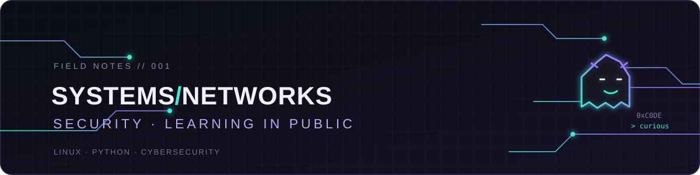

  

  <b>IT infrastructure · Linux · cybersecurity</b> 
  Building solid foundations in IT systems and networking, with a growing interest in cybersecurity.

  
  
  

### Current setup

  
  
  

### Tools I use

  
  
  
  
  
  

### What I'm exploring

- Python fundamentals
- Linux systems and networking
- Cybersecurity and penetration testing in authorized environments

Outside tech: building PCs, anime, and learning how things work under the hood.

<!-- Add a lowlighter/metrics card once public repositories and activity make the charts meaningful.
     Good first candidates: a compact commit calendar and language activity. -->

