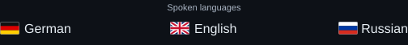
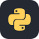

  

<h1 align="center">Hi, I'm YukoTen.</h1>

  Linux, networking and security.

  

<h3 align="center">Tools & systems</h3>

  
  
  
  
   
  
  
  
  
  
  
  

  

<!-- Brand icons are sourced from Simple Icons. Windows, Nmap and PuTTY use custom symbols. -->

